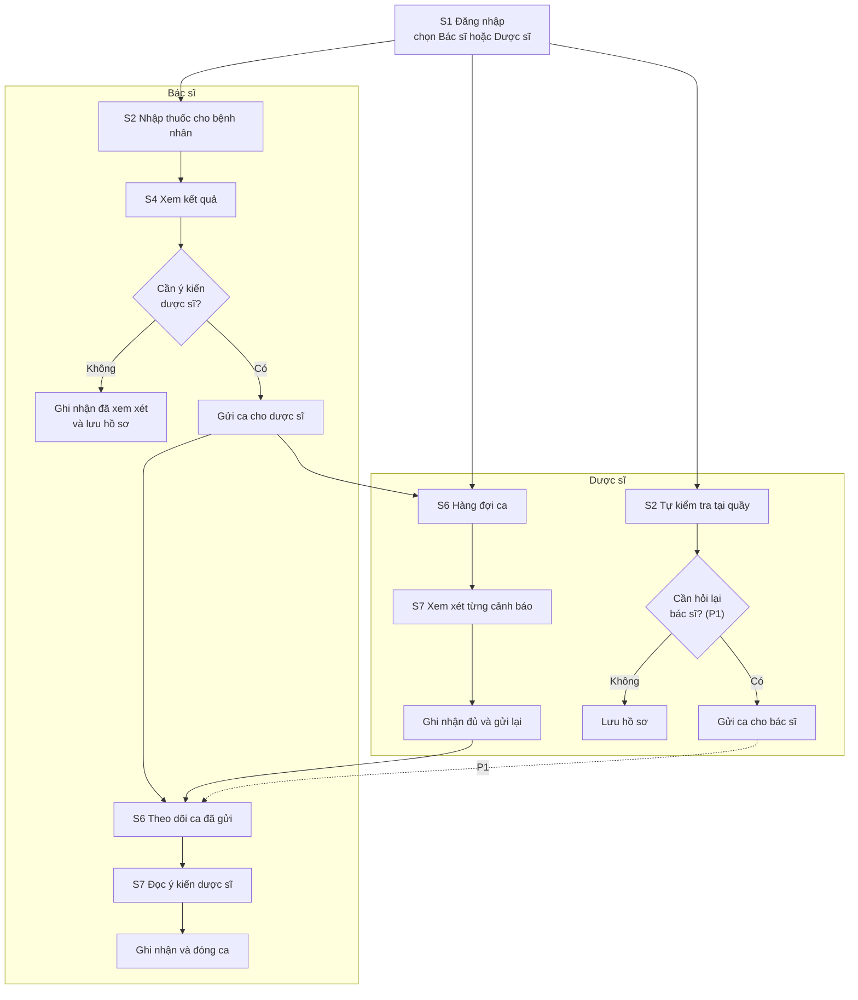
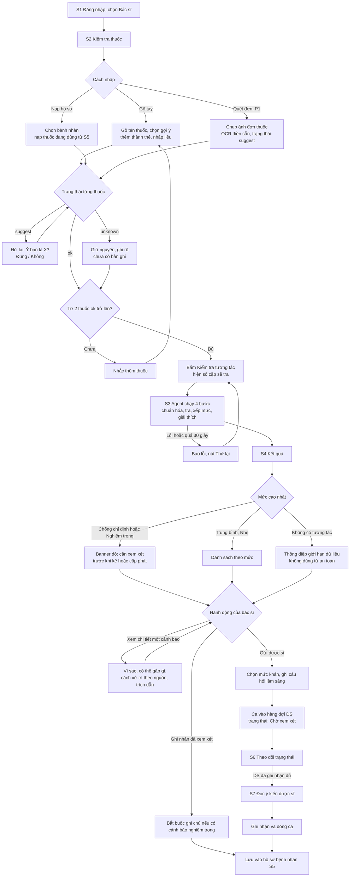
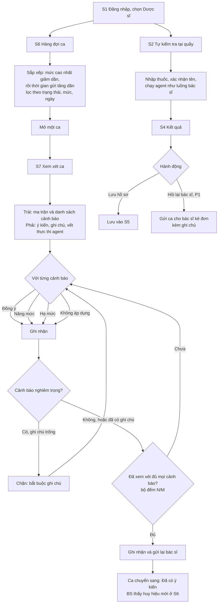
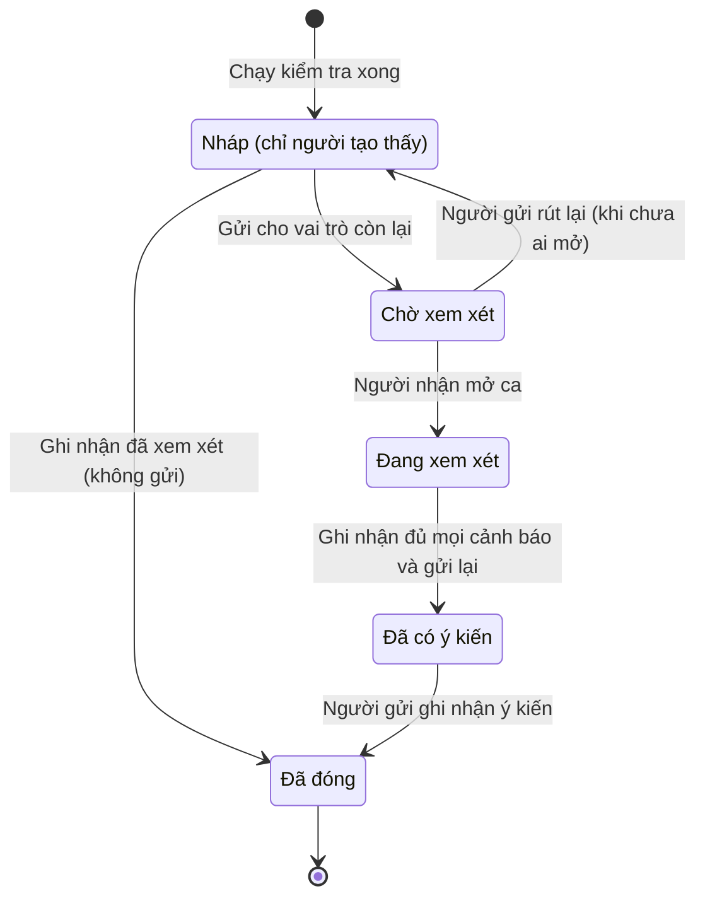

# User Flow v2 — Bác sĩ & Dược sĩ

> **Phiên bản:** 2.0 (03/10/2026) · **Thay thế:** mục "C. Wireframe và UI Flow" trong `docs/gate_01/Wireframe_UIFlow.docx` (luồng Bệnh nhân + Dược sĩ).
> **Trạng thái:** bản đề xuất để cả nhóm chốt. Các điểm cần quyết định nằm ở mục 9.

---

## 1. Thay đổi so với v1

| | v1 (Gate 1) | v2 (tài liệu này) |
|---|---|---|
| Vai trò | Bệnh nhân, Người nhà, Dược sĩ | **Bác sĩ, Dược sĩ** |
| Người nhập thuốc | Bệnh nhân tự nhập | Bác sĩ hoặc dược sĩ nhập thay cho bệnh nhân |
| Người ra quyết định | Bệnh nhân hỏi lại dược sĩ | **Bác sĩ/dược sĩ tự quyết định.** Hệ thống chỉ cảnh báo tham khảo |
| HITL | Chỉ một chiều: bệnh nhân → dược sĩ | Hai chiều: bác sĩ ⇄ dược sĩ (chiều dược sĩ → bác sĩ là P1) |
| Ngôn ngữ giải thích | Dễ hiểu cho người không chuyên | Thuật ngữ chuyên môn vừa phải, vẫn có nguồn |
| Banner nghiêm trọng | "Đừng tự ngừng thuốc, gọi 115" | "Cần xem xét trước khi kê/cấp phát", không có lời khuyên cho bệnh nhân |
| Bỏ đi | Câu hỏi gợi ý mang theo khi gặp dược sĩ; hỏi thêm agent bằng lời của bệnh nhân | Xem mục 9, câu hỏi 4 |

**Không đổi:** AI không khuyên ngưng/đổi/kê thuốc và không chẩn đoán. Mức độ lấy từ CSDL, LLM chỉ diễn giải. Không có bản ghi ≠ an toàn. Mọi kết luận phải có trích dẫn. Disclaimer luôn hiển thị.

---

## 2. Hai vai trò

| | **Bác sĩ (BS)** | **Dược sĩ (DS)** |
|---|---|---|
| Bối cảnh | Đang khám hoặc kê đơn, cần biết đơn mới có xung đột với thuốc bệnh nhân đang dùng không | Đang cấp phát tại quầy hoặc làm dược lâm sàng, nhận ca từ bác sĩ |
| Mục tiêu | Kiểm tra nhanh trong lúc khám, thấy mức độ + cơ chế + nguồn, tự quyết định | Kiểm tra đơn, xem xét từng cảnh báo có bằng chứng, trả ý kiến cho bác sĩ |
| Việc chính | Kiểm tra thuốc → xem kết quả → ghi nhận hoặc gửi DS | Xử lý hàng đợi ca → ghi ý kiến từng cảnh báo → gửi lại BS; tự kiểm tra khi cấp phát |
| Thời gian chấp nhận được | Dưới 1 phút/ca (đang trước mặt bệnh nhân) | Vài phút/ca, cần xem được vết thực thi của agent |

### Quyền theo vai trò

| Hành động | BS | DS |
|---|:-:|:-:|
| Kiểm tra thuốc (S2–S4) | ✅ | ✅ |
| Lưu hồ sơ thuốc bệnh nhân, xem lịch sử (S5) | ✅ | ✅ |
| Gửi ca cho vai trò còn lại | ✅ → DS | P1 → BS |
| Xem hàng đợi ca đến (S6) | Chỉ ca DS gửi (P1) | ✅ |
| Ghi ý kiến từng cảnh báo: đồng ý / nâng / hạ / không áp dụng (S7) | Chỉ với ca DS gửi (P1) | ✅ |
| Xem ý kiến của bên kia | ✅ (chỉ khi đã ghi nhận đủ) | ✅ |
| Xem vết thực thi của agent | ✅ chỉ đọc | ✅ chỉ đọc |
| Xem tên bệnh nhân đầy đủ | Chỉ ca mình phụ trách, có ghi log | Chỉ ca được giao, có ghi log |

---

## 3. Bản đồ màn hình

Giữ nguyên mã S1–S8 để không lệch với `frontend.md` và các tài liệu khác. Phần khác là **ai dùng** và **hành động ở cuối màn**.

| # | Màn hình | Route | BS | DS | Thay đổi so với v1 |
|---|---|---|:-:|:-:|---|
| S1 | Đăng nhập | `/login` | ✅ | ✅ | Radio vai trò còn **Bác sĩ / Dược sĩ** |
| S2 | Kiểm tra thuốc | `/check` | ✅ | ✅ | Dùng chung. Thêm ô **mã bệnh nhân**, nút **Nạp từ hồ sơ BN** |
| S3 | Agent đang chạy | `/check/[id]` | ✅ | ✅ | Không đổi |
| S4 | Kết quả | `/check/[id]` | ✅ | ✅ | Dùng chung, **hành động cuối khác theo vai trò** (mục 4, 5) |
| S5 | Hồ sơ thuốc & lịch sử | `/profile` | ✅ | ✅ | Chuyển từ hồ sơ của "tôi" sang **hồ sơ theo bệnh nhân** |
| S6 | Hàng đợi ca | `/queue` | ✅ | ✅ | DS: ca đến. BS: ca đã gửi + ý kiến đã về |
| S7 | Xem xét ca | `/cases/[id]` | ✅ | ✅ | DS ghi ý kiến. BS xem ý kiến và đóng ca |
| S8 | Nguồn dữ liệu | `/sources` | ✅ | ✅ | Không đổi |

Điều hướng sau đăng nhập: cả hai vào `/check`. DS có huy hiệu số ca chờ trên tab Hàng đợi. BS có huy hiệu khi có ý kiến DS mới về.

---

## 4. Luồng tổng quan (hai vai trò phối hợp)

---

## 5. Luồng chi tiết — Bác sĩ

**Điểm cần nhớ ở luồng bác sĩ**
- Hệ thống **không ghi "đã đổi thuốc" hay "đã ngưng thuốc"**. Nút "Ghi nhận đã xem xét" chỉ ghi bác sĩ đã đọc cảnh báo. Quyết định lâm sàng nằm ngoài hệ thống.
- Gửi dược sĩ là **tùy chọn**. Khi bác sĩ bỏ qua một cảnh báo nghiêm trọng mà không gửi, bắt buộc ghi chú lý do (phục vụ audit).
- Với ca đã gửi, bác sĩ vẫn xem được kết quả. Mục "ý kiến dược sĩ" chỉ hiện khi DS đã ghi nhận đủ mọi cảnh báo (giữ luật HITL của PRD).

---

## 6. Luồng chi tiết — Dược sĩ

**Điểm cần nhớ ở luồng dược sĩ**
- "Nâng/Hạ mức" chỉ là **ý kiến của dược sĩ gắn vào ca**, được ghi kèm tên người và thời gian. Nó **không sửa mức độ trong CSDL** và không thay đổi dữ liệu nguồn.
- Vết thực thi của agent (tool đã gọi, nguồn đã dùng, kết quả guardrail PASS/FAIL) luôn hiện ở S7, chỉ đọc.
- Đường "tự kiểm tra tại quầy" dùng đúng S2–S4 của bác sĩ. Khác nhau chỉ ở nút hành động cuối màn S4.

---

## 7. Vòng đời của một ca

| Trạng thái | Ai thấy | Hiển thị trong S5/S6 |
|---|---|---|
| Nháp | Người tạo | "Chưa gửi", có nút Gửi |
| Chờ xem xét | Người gửi, người nhận | Chờ dược sĩ (hoặc chờ bác sĩ) |
| Đang xem xét | Người gửi, người nhận | Có tên người đang mở |
| Đã có ý kiến | Người gửi, người nhận | Huy hiệu mới cho người gửi |
| Đã đóng | Người gửi, người nhận | Lưu lịch sử, chỉ đọc |

---

## 8. Trạng thái đặc biệt & lỗi

Giữ các quy tắc cũ ở `Wireframe_UIFlow.docx` mục 5 và `frontend.md` mục 9, bổ sung theo vai trò:

| Tình huống | Xử lý |
|---|---|
| Danh sách thuốc dưới 2 | Nhắc thêm thuốc, nút Kiểm tra bị khóa |
| Thuốc `suggest` | Phải xác nhận trước khi tra. **Không tự chấp nhận** |
| Thuốc `unknown` | Ghi "chưa có bản ghi trong CSDL", không đoán hoạt chất |
| Không có tương tác | Hiện giới hạn dữ liệu, tuyệt đối không dùng từ "an toàn" |
| Guardrail chặn đầu ra | Hiện nhãn "đã chặn khuyến nghị đổi thuốc", giữ bản ghi nguồn |
| LLM giải thích chậm hoặc lỗi | Vẫn hiện kết quả tra cứu và bản ghi gốc, giải thích tải sau |
| Bác sĩ cố đóng ca mà bỏ qua cảnh báo nghiêm trọng, không ghi chú | Chặn, bắt buộc ghi chú |
| Dược sĩ chưa xem hết cảnh báo mà bấm gửi | Chặn, hiện "Đã xem xét N/M" |
| Người dùng mở ca không thuộc quyền | Trang 403, link về `/check` |
| Mất kết nối khi đang chạy agent | Tự nối lại 3 lần, sau đó tải lại bằng `GET /checks/{id}` |
| Xem tên bệnh nhân đầy đủ | Mặc định hiện mã/viết tắt (`N. V. A.`). Bấm xem đủ thì ghi vào `audit_log` |

---

## 9. Câu hỏi cần nhóm chốt

1. **Gửi dược sĩ có bắt buộc không?** Đề xuất: tùy chọn, nhưng khi bác sĩ bỏ qua cảnh báo nghiêm trọng thì bắt buộc ghi chú. Nếu bắt buộc thì luồng bác sĩ chậm hơn nhiều khi đang khám.
2. **Có chiều dược sĩ → bác sĩ không?** Thực tế dược sĩ thường gọi bác sĩ khi thấy đơn có tương tác. Đề xuất: để P1, dùng lại đúng cơ chế ca ở S6/S7 đổi chiều. Nếu P0 thì phải sửa thêm hàng đợi của bác sĩ.
3. **Định danh bệnh nhân.** Đề xuất: chỉ nhập **mã bệnh nhân hoặc tên viết tắt**, không nhập họ tên đầy đủ, không đưa PII vào prompt. Cần quyết định có lưu tuổi/giới/bệnh nền (cần cho tương tác thuốc–bệnh, P1).
4. **Thay thế "Câu hỏi gợi ý khi gặp dược sĩ".** Với người dùng chuyên môn, đề xuất đổi thành mục "Cách xử trí theo nguồn" lấy nguyên văn từ bản ghi CSDL kèm trích dẫn, không do LLM tự viết. Cần dược sĩ xác nhận cách trình bày này không bị coi là khuyến nghị.
5. **Thống nhất nhãn quyết định ở S7.** `Wireframe_UIFlow.docx` và PRD ghi *Đồng ý / Nâng / Hạ / Không áp dụng*, còn `frontend.md` ghi *Acknowledge / Từ chối / Chuyển cấp*. Tài liệu này dùng bộ đầu. Cần sửa `frontend.md` cho khớp.
6. **Hàng đợi chung hay theo cơ sở/khoa?** MVP đề xuất hàng đợi chung, mọi dược sĩ thấy mọi ca. Phân theo cơ sở để sau.

---

## 10. Việc cần sửa theo

| Tài liệu / phần việc | Cần sửa gì |
|---|---|
| `docs/architecture/frontend.md` | Bỏ `(patient)` và `caregiver`, gộp thành `(clinician)`. Đổi `requireRole` còn `doctor`, `pharmacist`. Sửa S1, S4, S5, S6, S7 theo mục 3. Bỏ ghi chú "bệnh nhân 72 tuổi" ở phần accessibility |
| `docs/gate_01/PRD.docx` | Persona (bỏ bác Hòa, chị Lan, thêm BS và DS), F1–F16, luật PII, `users(role)` |
| `docs/gate_01/Wireframe_UIFlow.docx` | Thay mục 1, 2, 3 bằng nội dung tài liệu này |
| `Topic.md` | Giữ nguyên làm đề bài gốc (đề ghi "bệnh nhân & dược sĩ/bác sĩ"). Ghi chú trong README rằng nhóm chốt 2 vai trò BS/DS |
| `docs/KE_HOACH_DEN_07-10.md` mục 5 | C4–C6 của Chiến: luồng nhập thuốc và màn kết quả dùng chung cho 2 vai trò, thêm ô mã bệnh nhân, đổi hành động cuối S4. Hiện "Gửi dược sĩ" mới là nút không có `onClick` |
| API contract (mục 3 kế hoạch) | Thêm `patient_ref`, `case.status`, `case.to_role`. Chưa thêm gì vào `POST /checks/{id}/submit` cho tới khi chốt câu hỏi 1–2 |
| Backend | Bảng `reviews` cần thêm `from_role`, `to_role` nếu làm chiều DS → BS |

> Hạn chót vẫn là 12:00 thứ Tư 07/10, và sau mốc M2 (18:00 thứ Ba 06/10) ngừng thêm tính năng. Với thời gian còn lại, phần **P0 an toàn nhất** là: S1 → S2 → S3 → S4 dùng chung cho BS và DS, DS có S6 + S7. Phần BS theo dõi ca, chiều DS → BS và OCR nên để P1.
