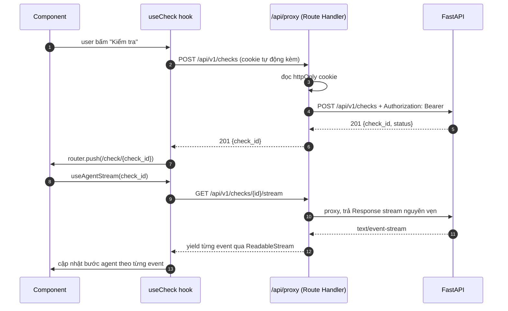

# Frontend Architecture — Next.js

> Phần chi tiết của [`ARCHITECTURE.md`](../../ARCHITECTURE.md) cho tầng Frontend.
> Nguồn yêu cầu: PRD mục C (Wireframe & UI Flow) trong `GATE 1 Submission/rathuoc-brief-prd-wireframe.pdf`.

---

## 1. Stack

| Thuộc tính | Lựa chọn | Ghi chú |
|-----------|-----------|---------|
| Framework | Next.js 15 (App Router) | PRD chỉ định Next.js |
| Runtime | React 19 | |
| Ngôn ngữ | TypeScript `strict: true` | Bắt buộc: type từ OpenAPI sinh ra |
| Styling | Tailwind CSS v4 | |
| State server | TanStack Query v5 | Cache, refetch, retry |
| State client | Zustand v5 | Chỉ state UI tạm (S3 streaming, form nháp) |
| Form | React Hook Form + Zod | Validation trùng khớp Pydantic |
| BFF | Next.js Route Handler | Giữ token server-side |
| Test | Vitest + RTL + Playwright | |
| Deploy | Vercel | |

## 2. Cấu trúc thư mục

Toàn bộ FE nằm trong `interface/fontend/`.

```text
interface/fontend/
├── app/
│   ├── layout.tsx                    # Root layout: fonts, ThemeProvider, Toaster
│   ├── globals.css                   # Tailwind + design tokens (CSS variables)
│   ├── not-found.tsx
│   ├── error.tsx                     # Error boundary
│   │
│   ├── (auth)/
│   │   └── login/page.tsx            # S1
│   │
│   ├── (patient)/
│   │   ├── layout.tsx                # PatientShell + requireRole('patient'|'caregiver')
│   │   ├── check/
│   │   │   ├── page.tsx              # S2
│   │   │   └── [checkId]/
│   │   │       ├── page.tsx          # S3 → S4 (cùng route, đổi view theo status)
│   │   │       └── loading.tsx
│   │   └── profile/page.tsx          # S5
│   │
│   ├── (pharmacist)/
│   │   ├── layout.tsx                # PharmaShell + requireRole('pharmacist'|'doctor')
│   │   ├── queue/page.tsx            # S6
│   │   └── cases/[caseId]/page.tsx   # S7
│   │
│   ├── (shared)/
│   │   └── sources/page.tsx          # S8
│   │
│   └── api/                          # BFF — KHÔNG đặt business logic ở đây
│       ├── auth/login/route.ts
│       ├── auth/logout/route.ts
│       └── proxy/[...path]/route.ts  # Proxy REST + SSE
│
├── components/
│   ├── ui/           Button, Input, Card, Badge, Dialog, Sheet, Table,
│   │                 Skeleton, EmptyState, Toast, Tabs, Tooltip
│   ├── layout/       AppShell, TopNav, BottomNav, RoleBadge, UserMenu
│   ├── severity/     SeverityBadge, AlertBanner, SeveritySummary, SeverityIcon
│   ├── drug-input/   DrugInput, DrugTag, NormalizeStatusChip,
│   │                 ConfirmNormalizationDialog, DrugFormGrid
│   ├── agent-progress/ AgentStepList, StepIndicator, StreamingIndicator
│   ├── findings/     FindingCard, InteractionMatrix, CitationList,
│   │                 DuplicateActiveWarning, NotFoundNotice
│   ├── review/       DecisionRadio, ReviewNote, ReviewActions, TraceViewer
│   └── profile/      MedProfileList, ProfileEditor, HistoryTable, OcrUpload
│
├── hooks/
│   ├── useAuth.ts
│   ├── useCheck.ts              # useCheck, useRunCheck, useSubmitCheck
│   ├── useAgentStream.ts        # SSE consumer
│   ├── useNormalize.ts          # debounce + normalize từng thuốc
│   ├── useCases.ts              # pharmacist queue
│   └── useReview.ts
│
├── lib/
│   ├── api/
│   │   ├── client.ts            # fetch wrapper: credentials, error mapping
│   │   ├── proxy.ts             # URL builder, header forwarding
│   │   ├── sse.ts               # ReadableStream → AsyncIterator
│   │   └── problem.ts           # parse RFC 9457 problem+json
│   ├── auth/
│   │   ├── session.ts           # đọc cookie, decode token
│   │   ├── guards.ts            # requireRole() cho layout
│   │   └── permissions.ts       # canAccess(user, action, resource)
│   ├── validation/schemas.ts    # Zod, mirror Pydantic
│   └── utils/
│       ├── cn.ts
│       ├── severity.ts          # nhãn, màu, thứ tự sắp xếp
│       ├── format.ts            # ngày, liều, tên viết tắt
│       └── pii.ts               # mask tên
│
├── stores/
│   ├── authStore.ts
│   ├── checkStore.ts            # danh sách thuốc đang nhập (S2)
│   └── agentStore.ts            # trạng thái streaming (S3)
│
├── types/
│   └── api.ts                   # SINH TỰ ĐỘNG từ openapi.json — không sửa tay
│
├── public/
└── tests/
    ├── unit/                    # Vitest
    └── e2e/                     # Playwright
```

## 3. Files cần tạo ở gốc `interface/fontend/`

| File | Vai trò |
|------|---------|
| `package.json` | Scripts: `dev`, `build`, `lint`, `test`, `test:e2e` |
| `tsconfig.json` | `strict: true`, alias `@/*` → `./*` |
| `next.config.ts` | `output`, `images.remotePatterns` |
| `tailwind.config.ts` | Nội dung Tailwind (v3) hoặc `@import "tailwindcss"` (v4) |
| `postcss.config.mjs` | Plugin `@tailwindcss/postcss` |
| `vitest.config.ts` | Test runner + alias |
| `playwright.config.ts` | `baseURL: http://localhost:3000` |
| `.env.local.example` | `API_URL`, `NEXT_PUBLIC_API_URL` |
| `eslint.config.mjs` | ESLint flat config |
| `.gitkeep` | Giữ thư mục rỗng (đã tạo) |

## 4. Routing table

| Màn | Route | Vai trò | Rendering | Mô tả |
|-----|-------|---------|-----------|--------|
| S1 | `/login` | public | Client | Chọn vai trò + đăng nhập |
| — | `/` | authenticated | Server | Redirect theo role |
| S2 | `/check` | patient, caregiver | Client | Nhập & xác nhận danh sách thuốc |
| S3 | `/check/[checkId]` | owner | Client + SSE | Agent đang chạy |
| S4 | `/check/[checkId]` | owner | Server + island | Kết quả (cùng route, view theo `status`) |
| S5 | `/profile` | patient, caregiver | Server | Hồ sơ thuốc + lịch sử |
| S6 | `/queue` | pharmacist, doctor | Server | Hàng đợi ca |
| S7 | `/cases/[caseId]` | pharmacist, doctor | Server + island | Xem xét ca |
| S8 | `/sources` | authenticated | Server | Nguồn dữ liệu & giới hạn |

**Route groups** `(auth)`, `(patient)`, `(pharmacist)`, `(shared)` chỉ để nhóm layout — **không** xuất hiện trong URL.

### Bảo vệ route

```tsx
// app/(patient)/layout.tsx
export default async function PatientLayout({ children }: { children: React.ReactNode }) {
  const user = await requireRole(['patient', 'caregiver']);
  return <PatientShell user={user}>{children}</PatientShell>;
}
```

`requireRole` chạy ở **Server Component** (`redirect('/login')` nếu sai). Luôn luôn kiểm tra lại ở backend — layout chỉ là UX, không phải lớp bảo mật.

## 5. Màn hình chi tiết

### S1 — Đăng nhập `/login`

- Radio chọn vai trò: **Bệnh nhân** / **Dược sĩ** — quyết định layout sau khi login.
- Email + mật khẩu, nút Đăng nhập, link Quên mật khẩu.
- Submit → `POST /api/v1/auth/login` qua BFF. BFF set httpOnly cookie, trả user cho client.
- Redirect theo role: patient → `/check`, pharmacist → `/queue`.
- Error: hiện `detail` từ problem+json, không show stack trace.

### S2 — Kiểm tra thuốc `/check`

Bố cục 2 cột trên desktop, 1 cột xếp dọc trên mobile.

**Cột tráp — nhập thuốc:**
- Ô nhập có autocomplete. Gõ ≥ 2 ký tự → debounce 400ms → `POST /api/v1/normalize` hiển thị gợi ý.
- Thêm thuốc vào list dưới dạng `DrugTag` với `NormalizeStatusChip`:
  - `ok` → chip xanh, tên đã chuẩn hóa.
  - `suggest` → chip vàng + nút **Đổng ý / Xem thêm** → mở `ConfirmNormalizationDialog` liệt kê các đề xuất. **Không auto-accept.**
  - `unknown` → chip xám "chưa có bản ghi", cho phép giữ nguyên và tiếp tục.
- Mỗi tag có ô liều (vd "81mg") và nút xoá.
- Nút **Quét ảnh đơn thuốc** (P1) → mở `OcrUpload`, kết quả điền sẵn vào list ở trạng thái `suggest`.
- Nút **Kiểm tra tương tác** — disabled khi list rỗng. Hiển thị "cần ít nhất 2 thuốc".

**Cột phải — agent làm gì (tĩnh):**
4 bước: ① Chuẩn hóa tên ② Tra tương tác ③ Xếp mức nghiêm trọng ④ Giải thích kèm nguồn.
Khung an toàn (luôn hiện): *"AI không khuyên ngưng/đổi/kê thuốc. Quyết định do bác sĩ/dược sĩ."*

**Đếm số cặp:** hiển thị "sẽ tra N cặp" (N = n(n−1)/2). Với > 15 thuốc, cảnh báo số cặp lớn và giới hạn tối đa 50 theo validation backend.

### S3 — Agent đang chạy `/check/[checkId]`

- Sau khi POST `/checks` trả `check_id`, điều hướng tới route này rồi nối `GET /checks/{id}/stream`.
- `AgentStepList` hiển thị 4 bước, trạng thái: chờ → đang chạy (spinner) → xong (✓) → lỗi (✗).
- SSE event `step` → bật bước tương ứng. Event `finding` → hiện dòng tóm tắt ngay dưới (tạo hiệu ứng "phát hiện dần").
- `StreamingIndicator`: dấu ba chấm nhấp nháy + nút **Huỷ** (abort fetch).
- Có fallback: nếu SSE fail → nút "Tải lại kết quả" gọi `GET /checks/{id}`.
- Timeout 30s → hiện thông báo lỗi kèm nút thử lại. Không để spinner vô hạn.

### S4 — Kết quả `/check/[checkId]`

**Banner đầu trang (điều kiện):** nếu `max_severity = major/contraindicated` → `AlertBanner` màu đỏ, nội dung nghiêm trọng + nút **Liên hệ ngay**. Trước khi dược sĩ `acknowledge`, banner ghi *"Đang chờ dược sĩ xem xét"* thay vì khuyến nghị hành động.

**Tóm tắt mức:** `SeveritySummary` — đếm theo `!!` `!` `i` `=` + số thuốc chưa có bản ghi.

**Ma trận tương tác ( trái):**
- Grid N×N, tô màu theo mức tương tác giữa từng cặp thuốc.
- Diagonal = hoạt chất đã chuẩn hóa.
- Diagonal bị gạch chéo = phát hiện trùng hoạt chất.
- Mobile: thu gọn thành danh sách cảnh báo thay vì grid (bảng N×N không đọc được trên màn hình nhỏ).

**Chi tiết (phải):** click vào ô → panel hiện `FindingCard`:
- Tiêu đề tương tác (vd "NSAID + warfarin")
- Mức độ + cơ chế
- Giải thích dễ hiểu
- Khuyến nghị hành động đúng hướng dược sĩ
- `CitationList` — nguồn dạng `[1] DAV — mở liên kết`
- Nút **Hỏi thêm agent** (textarea ở cuối) — hỏi lại, agent chỉ dựa trên ngữ cảnh đã có.

**Footer:** disclaimer bắt buộc (luôn hiện), 2 nút **Gửi dược sĩ** và **Lưu hồ sơ**.

### S5 — Hồ sơ & lịch sử `/profile`

- Danh sách thuốc đang dùng, có sẵn từ lần trước → nút "Kiểm tra cả hồ sơ" (1 click, không phải nhập lại).
- Bảng lịch sử: mã ca, ngày, số thuốc, mức cao nhất, trạng thái (`chờ dược sĩ` / `đã xem`).
- Nút **Gửi dược sĩ** trên từng dòng lịch sử chưa gửi.
- Bệnh nền & dị ứng (P1) — ảnh hưởng tương tác thuốc–bệnh.

### S6 — Hàng đợi ca `/queue`

Bảng: Mã ca · Bệnh nhân (viết tắt) · Số thuốc · Cảnh báo cao nhất · Trạng thái · Thao tác.

- Sort mặc định `max_severity` giảm dần, sau đó `created_at` tăng dần.
- Bộ lọc: trạng thái, khoảng thời gian, mức nghiêm trọng.
- Ô tìm kiếm theo mã ca.
- Với bác sĩ: cột *Số thuốc* đổi thành *Số ca đang chờ*.
- Tên bệnh nhân hiển thị dạng viết tắt (`N. V. A.`) — phân quyền chỉ dành dược sĩ mới xem đầy đủ.

### S7 — Xem xét ca `/cases/[caseId]`

Ba khối:
1. **Trái** — mã ca + danh sách cảnh báo (giống S4, dạng read-only).
2. **Phải trên** — khung quyết định: radio *Acknowledge (●)* / *Từ chối (○)* / *Chuyển cấp (○)* + textarea ghi chú + nút **Ghi nhận và gửi lại bệnh nhân**.
   - Nút gửi disabled nếu chưa chọn quyết định.
   - Không cho acknowledge mà để trống ghi chú khi cảnh báo mức nghiêm trọng.
3. **Phải dưới** — "Vật thực thi của agent": timeline các node, tool nào được gọi, kết quả guardrail. Dành cho dược sĩ kiểm chứng, không chỉnh sửa được.

### S8 — Nguồn dữ liệu `/sources`

- Bảng nguồn: tên, vai trò, URL, **ngày cập nhật cuối**, giấy phép.
- Khối "Giới hạn dữ liệu" nổi bật: thuốc ngoài CSDL không được kiểm tra; độ phủ theo hoạt chất; CSDL nguồn chỉ mang tính tham khảo.
- Liên kết tới từng citation ở S4/S7.

## 6. Design system

### Token màu

Định nghĩa bằng CSS variable trong `globals.css`, ánh xạ Tailwind semantic token.

| Mức | Token | Màu | Dùng cho |
|-----|-------|------|----------|
| Nghiêm trọng | `--severity-critical` | đỏ | Banner, viền finding |
| Trung bình | `--severity-major` | cam | Badge finding |
| Nhẹ | `--severity-minor` | vàng | Badge finding |
| Trùng hoạt chất | `--severity-duplicate` | tím nền sẫm | Badge cảnh báo |
| Chưa có bản ghi | `--severity-not-found` | xám xanh | Chữ thường |
| Thành công | `--status-success` | xanh | Trạng thái đã xử lý |
| Cảnh báo | `--status-warning` | hổ phách | Trạng thái chờ |

**Không dùng màu làm tín hiệu duy nhất** — luôn kèm ký hiệu `!!` `!` `i` `=` hoặc nhãn chữ. Đây là yêu cầu WCAG 1.4.1 và cũng là trạng thái đặc biệt trong wireframe.

### Typography & accessibility

| Thuộc tính | Giá trị | Lý do |
|-----------|---------|-------|
| Font size gốc | 16px | Bệnh nhân 72 tuổi, đọc trên điện thoại |
| Line height | 1.6 | Tăng khoảng cách dòng cho người đọc lâu |
| Chiều cao tap target | ≥ 44px | Nút bệnh nhân 72 tuổi hay bấm trượt |
| Contrast | ≥ 4.5:1 (AA) | Bắt buộc |
| Focus ring | luôn hiện, không bỏ `outline` | Điều hướng bằng bàn phím |
| Tôn trọng `prefers-reduced-motion` | tắt animation | Chóng mặt, động kinh |

### Responsive

| Breakpoint | Layout |
|-----------|--------|
| `< 640px` (mobile) | 1 cột, ma trận tương tác thu gọn thành danh sách, thanh điều hướng dưới |
| `≥ 1024px` (desktop) | 2 cột, ma trận dạng lưới, sidebar dược sĩ |

Mobile là ưu tiên chính — người dùng chính bệnh nhân 72 tuổi, người nhà, dược sĩ dùng tablet/điện thoại.

## 7. State management

| Loại | Công cụ | Ví dụ |
|------|----------|-------|
| Dữ liệu server | TanStack Query | `/cases`, `/checks/{id}`, `/profile` |
| Dữ liệu form | React Hook Form | nhập thuốc, ghi chú dược sĩ, đăng nhập |
| State UI tạm | Zustand | danh sách thuốc đang nhập (S2), bước agent (S3) |
| Server state đọc 1 lần | RSC `fetch` | layout, S8, trang danh sách |

**Quy tắc:** dữ liệu nào server sở hữu thì TanStack Query quản lý, không copy vào Zustand. Zustand chỉ giữ trạng thái mà server không biết (thuốc đang gõ dở, bước streaming hiện tại).

### Shape của `checkStore` (S2)

```ts
interface DraftDrug {
  inputName: string;          // nguyên văn user gõ
  dosage?: string;
  status: 'pending' | 'ok' | 'suggest' | 'unknown';
  resolved?: { canonicalName: string; activeIngredients: string[] };
  suggestions?: Array<{ name: string; confidence: number }>;
  userConfirmed: boolean;     // bắt buộc true nếu status = 'suggest'
}

interface CheckStore {
  drugs: DraftDrug[];
  addDrug(inputName: string): Promise<void>;   // tự gọi normalize
  confirmDrug(index: number, chosenName: string): void;
  removeDrug(index: number): void;
  canSubmit: () => boolean;                    // ≥ 2 thuốc, không còn suggest chưa xác nhận
}
```

## 8. Luồng dữ liệu qua BFF



**Quy tắc BFF:**
1. Chỉ proxy. Không xử lý nghiệp vụ, không transform response.
2. Luôn forward `Cookie` → `Authorization`, và ngược lại `Set-Cookie`.
3. **Không** forward response header nhạy cảm (`x-powered-by`, `server`).
4. BFF **không** log body request/response (chứa PHI).
5. Nếu API lỗi, trả nguyên problem+json với status giữ nguyên.

## 9. Xử lý lỗi & trạng thái rỗng

| Tình huống | Xử lý |
|------------|--------|
| Lỗi mạng / 5xx | Toast + nút thử lại, không mất dữ liệu form |
| 401 | Xoá cache query → redirect `/login` |
| 403 sai vai trò | Trang 403 với link về trang phù hợp vai trò |
| 422 validation | Highlight field, hiện message cụ thể từ `detail` |
| Không có tương tác | `EmptyState`: *"Không tìm thấy tương tác nào trong CSDL. Điều này không có nghĩa là an toàn tuyệt đối."* |
| Thuốc ngoài CSDL | `NotFoundNotice` + link S8 |
| Timeout agent | Thông báo + nút thử lại, không spinner vô hạn |
| SSE mất kết nối | Tự reconnect 3 lần với backoff, sau đó fallback sang `GET /checks/{id}` |

**Nguyên tắc:** không bao giờ hiển thị trạng thái rỗng mà không kèm giải thích. "Không có dữ liệu" ≠ "không có vấn đề" — phải nói rõ.

## 10. Security

| Biện pháp | Cách thực hiện |
|-----------|----------------|
| Không lưu token ở client | Refresh token trong httpOnly cookie; access token trong memory của `lib/api/client.ts` |
| Không render HTML không tin cậy | Không dùng `dangerouslySetInnerHTML`. Kết luận agent hiển thị dạng text + component cấu trúc (`FindingCard`) |
| Validate form | Zod chạy client, Pydantic chạy server — không tin validation client |
| Upload ảnh | Client kiểm tra MIME + kích thước; server kiểm tra lại magic bytes |
| Không lộ PII | `lib/utils/pii.ts` mask tên trước khi render ở màn không phải dược sĩ |
| Dependency | Chạy `npm audit` trong CI; pin phiên bản |

> Vì không dùng `dangerouslySetInnerHTML`, phần giải thích từ LLM nên được backend cấu trúc sẵn (field `explanation`, `title`, `citations` tách riêng) thay vì trả về markdown tự do. Đây cũng là lý do `FindingCard` nên là component có cấu trúc, không phải khối text.

## 11. Testing

| Loại | Công cụ | Ví dụ |
|------|---------|-------|
| Unit component | Vitest + RTL | `SeverityBadge` render đúng nhãn + màu + ký hiệu |
| Unit hook | Vitest | `useNormalize` debounce đúng, gọi API đúng số lần |
| Validation | Vitest | Zod chặn list rỗi, list 1 thuốc, > 50 thuốc |
| BFF route | Vitest | Proxy forward cookie, trả nguyên problem+json |
| E2E S1→S4 | Playwright | Đăng nhập → nhập 2 thuốc → xem kết quả |
| E2E suggest | Playwright | Tên sai chính tả → modal hỏi → xác nhận → chạy được |
| E2E dược sĩ | Playwright | Queue → mở ca → acknowledge + ghi chú → bệnh nhân thấy trạng thái |
| E2E guardrail | Playwright | Câu hỏi bẫy → UI hiện badge "Đã chặn khuyến nghị" |

Mock API bằng Playwright `page.route()` hoặc MSW. Test không được gọi LLM thật.

## 12. Checklist nghiệm thu frontend

- [ ] Chạy được trên màn hình 360px (không tràn ngang)
- [ ] Mọi mức nghiêm trọng có ký hiệu chữ, không chỉ màu
- [ ] Disclaimer hiển thị trên **mọi** màn có kết quả agent
- [ ] Không có màn nào hiển thị lời khuyên đổi/ngưng thuốc
- [ ] Suggest không bao giờ tự động được chấp nhận
- [ ] Truyền `status: unknown` hiển thị giới hạn dữ liệu, không hiện "an toàn"
- [ ] Token không xuất hiện trong `localStorage`/`sessionStorage`
- [ ] Tên bệnh nhân được mask ở màn không dành cho dược sĩ
- [ ] S3 có xử lý timeout và mất kết nối SSE
- [ ] Focus ring không bị xoá ở bất kỳ component nào
- [ ] `npm run build` không có lỗi TypeScript
- [ ] Lighthouse Performance ≥ 90 trên S4
