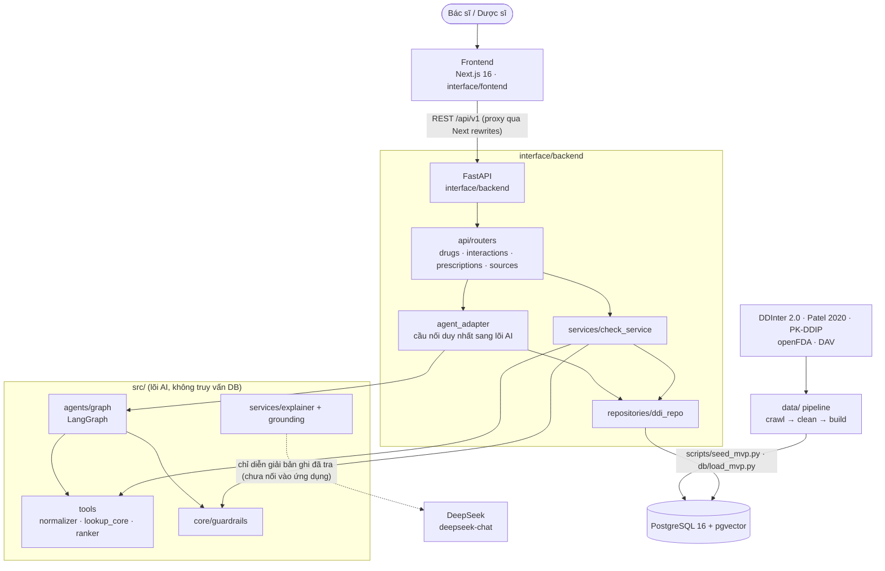
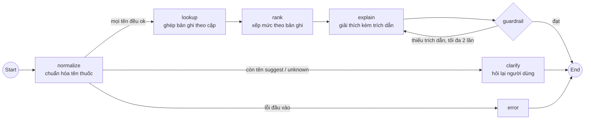
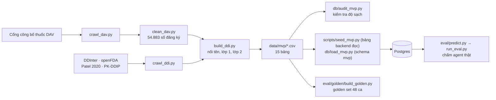

# Architecture Diagram

Sơ đồ kiến trúc của Rà Thuốc (P-060), vẽ theo mã nguồn hiện có. Thiết kế chi tiết và các quyết định kiến trúc nằm ở
[ARCHITECTURE.md](../ARCHITECTURE.md); ranh giới giữa backend và lõi AI nằm ở
[interface/backend/README.md](../interface/backend/README.md).

## System Overview

Chiều phụ thuộc chỉ đi một hướng: `interface/backend → src`. Lõi AI nhận dữ liệu đã tra sẵn (danh mục tên thuốc và
bản ghi tương tác) qua `agent_adapter`, nên chạy và test được mà không cần Database.

## Agent Flow

| Node | Việc làm | Có gọi LLM |
|---|---|---|
| `normalize` | Tách danh sách thuốc, tra bảng tên (`aliases`). Tên gần đúng không tự nhận | Không |
| `clarify` | Dừng lại, hỏi người dùng xác nhận tên `suggest` hoặc `unknown` | Không |
| `lookup` | Ghép bản ghi tương tác vào từng cặp; cặp không có bản ghi ghi rõ `no_record` | Không |
| `rank` | Xếp mức độ lấy thẳng từ bản ghi nguồn, hiển thị mức cao nhất | Không |
| `explain` | Viết lời giải thích tiếng Việt, gắn trích dẫn `[n]` và disclaimer | Không trong graph; `src/services/explainer.py` dùng DeepSeek cho phần "vì sao" |
| `guardrail` | Chặn kết luận không nguồn, lời khuyên đổi thuốc, câu khẳng định "an toàn" | Không |

## Data Flow

Chi tiết từng bước và số liệu: [DATA_PIPELINE.md](DATA_PIPELINE.md).

## Component Details

| Component | Technology | Purpose |
|-----------|-----------|---------|
| Frontend | Next.js 16, React 19, Tailwind v4 | Nhập đơn, xem cảnh báo, hàng đợi xem xét |
| Backend | FastAPI, SQLAlchemy async | Kiểm tra đầu vào, điều phối nghiệp vụ, truy vấn CSDL |
| Agent | LangGraph | Điều phối normalize → lookup → rank → explain → guardrail |
| Tools | Python thuần (`src/tools`) | Chuẩn hóa tên, tra cặp, xếp mức; tái lập được, không dùng LLM |
| Guardrail | Luật (`src/core/guardrails.py`) | Bắt buộc trích dẫn, chặn lời khuyên đổi thuốc |
| LLM | DeepSeek `deepseek-chat` | Diễn giải "vì sao" từ bản ghi đã tra được (`src/services/explainer.py`); hiện chưa nối vào ứng dụng, agent giải thích bằng mẫu tất định |
| Database | PostgreSQL 16, pgvector, pg_trgm, unaccent | Dữ liệu tham chiếu và bảng nghiệp vụ (đơn, lần kiểm tra, ca xem xét) |
| Data pipeline | pandas, rapidfuzz (`data/`) | Thu thập, làm sạch, dựng 15 bảng dữ liệu |
| Evaluation | Metric tất định, Ragas, LLM-as-a-judge (`eval/`) | Chấm agent trên golden set |
